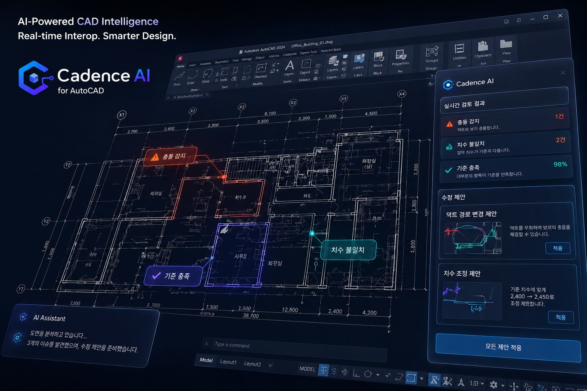

<br>

# <div align="center"> **<span style="color: #0162e0;">Cadence AI</span>: Enterprise CAD-sLLM 자동화 플랫폼** </div>

<div align="center">



<br>

**"기업의 설계 자산, 이제 AI가 검토하고 실시간으로 소통합니다."**

</div>

<br><br>

# 1. 팀 소개 
## 팀 명 : **Cadence AI** 

<div align="center">
  <table width="100%" style="border-collapse: collapse; text-align: center; font-size: 14px; margin: auto; table-layout: fixed;">
  <tr>
      <td width="20%" align="center" style="border: 1px solid #ddd; padding: 10px; vertical-align: middle;">
        
      </td>
      <td width="20%" align="center" style="border: 1px solid #ddd; padding: 10px; vertical-align: middle;">
         
      </td>
      <td width="20%" align="center" style="border: 1px solid #ddd; padding: 10px; vertical-align: middle;">
        
      </td>
      <td width="20%" align="center" style="border: 1px solid #ddd; padding: 10px; vertical-align: middle;">
         
      </td>
      <td width="20%" align="center" style="border: 1px solid #ddd; padding: 10px; vertical-align: middle;">
        
      </td>
  </tr>
  <tr style="background-color: #f9f9f9; font-weight: bold;">
    <td style="border: 1px solid #ddd; padding: 8px;">양창일</td>
    <td style="border: 1px solid #ddd; padding: 8px;">김다빈</td>
    <td style="border: 1px solid #ddd; padding: 8px;">김민정</td>
    <td style="border: 1px solid #ddd; padding: 8px;">김지우</td>
    <td style="border: 1px solid #ddd; padding: 8px;">송주엽</td>
  </tr>
  <tr style="background-color: #ffffff; font-weight: bold;">
    <td style="border: 1px solid #ddd; padding: 8px; color: #555;"><span style="font-size: 13px; font-weight: bold;">PM/AI/BE</span></td>
    <td style="border: 1px solid #ddd; padding: 8px; color: #555;"><span style="font-size: 13px; font-weight: bold;">APM/AI/BE</span></td>
    <td style="border: 1px solid #ddd; padding: 8px; color: #555;"><span style="font-size: 13px; font-weight: bold;">AI/FE</span></td>
    <td style="border: 1px solid #ddd; padding: 8px; color: #555;"><span style="font-size: 13px; font-weight: bold;">AI/BE/FE</span></td>
    <td style="border: 1px solid #ddd; padding: 8px; color: #555;"><span style="font-size: 13px; font-weight: bold;">AI/BE/FE/Infra</span></td>
  </tr>
  <tr>
    <td style="border: 1px solid #ddd; padding: 12px 10px; color: #555; vertical-align: top;">
          <div style="font-size: 10px; text-align: left; line-height: 1.5;">
              - 프로젝트 총괄 및 기획<br>
              - vLLM 추론 엔진 최적화<br>
              - 소방 에이전트 설계 및 구현<br>
          </div>
    </td>
    <td style="border: 1px solid #ddd; padding: 12px 10px; color: #555; vertical-align: top;">
          <div style="font-size: 10px; text-align: left; line-height: 1.5;">
              - 건축 에이전트 설계<br>
              - Autocad Plugin 설계 및 구현<br>
              - 프로젝트 산출물 및 문서 총괄
          </div>
    </td>
    <td style="border: 1px solid #ddd; padding: 12px 10px; color: #555; vertical-align: top;">
          <div style="font-size: 10px; text-align: left; line-height: 1.5;">
              - WEB UI/UX<br>
              - 초기 소방 에이전트 설계<br>
              - KPI 지표 수정 및 추가<br>
              - 서버 상태 확인 API<br>
              - 산출물 작성<br>
          </div>
    </td>
    <td style="border: 1px solid #ddd; padding: 12px 10px; color: #555; vertical-align: top;">
          <div style="font-size: 10px; text-align: left; line-height: 1.5;">
              - 전기 에이전트 설계<br>
              - DB 관리 및 설계<br>
              - AutoCAD UI/UX/Plugin 설계 및 구현<br>
              - [WEB] Docker & AWS EC2 배포<br>
              - C# ↔ Python Interop 설계<br>
          </div>
    </td>
    <td style="border: 1px solid #ddd; padding: 12px 10px; color: #555; vertical-align: top;">
          <div style="font-size: 10px; text-align: left; line-height: 1.5;">
              - 배관 에이전트 설계<br>
              - Docker & AWS 배포<br>
              - langfuse 설계 및 구현<br>
              - KPI 설계 및 구현<br>
              - WEB 백엔드 연동
          </div>
    </td>
  </tr>
  <tr style="background-color: #ffffff;">
    <td align="center" style="border: 1px solid #ddd; padding: 8px;">
        <a href="https://github.com/clachic00"></a>
    </td>
    <td align="center" style="border: 1px solid #ddd; padding: 8px;">
        <a href="https://github.com/tree0327"></a>
    </td>
    <td align="center" style="border: 1px solid #ddd; padding: 8px;">
        <a href="https://github.com/minjeong-kim-dev"></a>
    </td>
    <td align="center" style="border: 1px solid #ddd; padding: 8px;">
        <a href="https://github.com/jooooww"></a>
    </td>
    <td align="center" style="border: 1px solid #ddd; padding: 8px;">
        <a href="https://github.com/JUYEOP024"></a>
    </td>
  </tr>
</table>

</div>

<br><br>

## 2. 프로젝트 개요

**Cadence AI**는 단순한 도면 뷰어를 넘어, 엔지니어링 기업의 라이선스 자산과 복잡한 법규 검토 워크플로우를 완벽하게 제어하는 **B2B 엔지니어링 운영 플랫폼**입니다.    
AI 에이전트 분석 결과를 실시간으로 동기화하여 시각화하고, 구독 모델과 기기별 라이선스 보안 시스템을 통해 기업 고객에게 실제 상용화 가능한 수준의 관리 환경을 제공합니다.

- **진행 기간**: 2025.04.06 ~ 2026.05.20
- **메인 저장소**: [Cadence AI GitHub 바로가기](https://github.com/SKNETWORKS-FAMILY-AICAMP/SKN23-FINAL-2TEAM)
- **핵심 가치**: 기술적 분석을 넘어선 실질적인 '비즈니스 운영 및 보안' 환경 구축

## 3. 시연 영상

### 3.1 기업 관리자 페이지


### 3.2 시스템 관리자 페이지

## 4. 주요 기능
### 4.1 공통 기능

- 로그인 / 회원가입
- 구독 요금제 조회 및 선택
- 문의하기

### 4.2 기업 관리자 기능

- 구독 요금제 결제
- 구독 좌석 수 기반 CAD 플러그인 인증 키 발급
- 인증 키 조회 및 관리
- 등록 기기 조회 및 관리
- 플러그인 다운로드
- 계정 정보 조회 및 수정

### 4.3 시스템 관리자 기능

- 관리자 전용 대시보드 조회
- 기업 사용자 승인 및 관리
- 결제 내역 조회 및 관리
- 등록 기기 조회 및 관리
- 파일 업로드 관리
- 통계 자료 조회

<br />

## 5. 기술 스택

### Frontend Management Web
    

### Backend
  

### Database & Storage
  

### CAD Plugin / Related System
 

<br />

## 6. 시스템 아키텍처

본 서비스는 AutoCAD 플러그인, Backend API, Frontend Management Web, Storage & Infrastructure로 구성됩니다.  
WEB은 React 기반의 관리자 대시보드로, Backend API와 연동하여 기업 관리자 및 시스템 관리자 기능을 제공합니다.


<br />

## 7. 페이지 구조

### 7.1 공통 페이지

| Method | 화면 | 경로 | 설명 |
|:---:|---|---|---|
| GET  | Landing | `/` | 서비스 소개 및 주요 기능 안내 |
| POST  | Login / Signup | `AuthModal (Pop-up)` | 사용자 로그인 및 회원가입 (모달 방식) |
| GET  | Support | `/inquiries`, `/faq` | 1:1 문의 및 자주 묻는 질문(FAQ) |

<br />

### 7.2 기업 관리자 페이지

| Method | 화면 | 경로 | 설명 |
|:---:|---|---|---|
| GET | My Page | `/profile` | 계정 설정, 라이선스 키 발급, 기기 관리, 플러그인 다운로드 | 
| GET | Pricing | `/pricing` | 서비스 요금제 상세 안내 및 플랜 비교 | 
| POST | Payment | `/payment` | 구독 결제 진행 |
| GET | Payment Success/Fail | `/payment/success`, `/payment/fail` | 결제 완료 및 실패 결과 화면 | 
| GET | Download | `/download` | AutoCAD 플러그인 설치 파일 다운로드 전용 페이지 |

<br />

### 7.3 시스템 관리자 페이지

| Method | 화면 | 경로 | 설명 |
|:---:|---|---|---|
| POST | Admin Authentication | `/login` | 4자리 보안 PIN을 통한 시스템 관리자 인증 화면 |
| GET | Admin Dashboard | `/admin` | 기업 승인, 결제/기기 관리, 파일 업로드 및 통계 조회 |
<br />

## 8. 프로젝트 구조

```bash
# WEB 저장소 구조
├── backend/                # FastAPI 관리 백엔드
│   ├── app.py              # 애플리케이션 진입점 및 설정
│   ├── api/                # 공용 API 스키마
│   ├── core/               # DB 연결, 인증 및 핵심 유틸리티
│   ├── models/             # SQLAlchemy DB 테이블 모델
│   ├── routers/            # 결제, 라이선스, 관리자 전용 라우터
│   ├── services/           # S3 업로드, 이메일 발송, 결제 검증 서비스
│   └── static/             # 플러그인 바이너리 등 정적 파일 서빙
├── frontend/               # React 프론트엔드
│   ├── user/               # 사용자 대시보드 및 구독 관리 페이지
│   │   └── src/app/
│   │       ├── api/        # 백엔드 연동 API 클라이언트
│   │       ├── components/ # 공통 UI 및 라이선스 관련 컴포넌트
│   │       ├── context/    # 인증 및 전역 상태 컨텍스트
│   │       ├── pages/      # 메인 대시보드, 결제, 프로필 페이지
│   │       └── utils/      # 날짜 포맷 등 유틸리티 함수
│   └── admin/              # 관리자 전용 승인 및 통계 페이지
│       └── src/app/
│           ├── components/ # 관리자 전용 컴포넌트
│           ├── contexts/   # 관리자 전역 상태 컨텍스트
│           ├── pages/      # 관리자 메인 페이지
│           └── utils/      # 관리자 유틸리티 함수
├── devtools/               # 배포 및 개발용 도구 스크립트
└── uploads/                # 업로드 임시 저장 디렉토리
```

<br />
